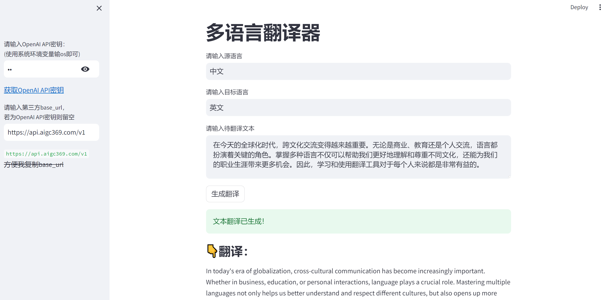

# 全语种翻译器
本项目基于LangChain框架，前端使用streamlit库，完全基于python语言编写了一个全语种翻译器。、

## 快速启动

打开终端，切换到项目所在文件夹下，输入以下命令进行相关库的安装（推荐新建一个anaconda下的python环境，方便管理）

```shell
pip install -r requirements.txt
```

输入以下命令运行项目，会自动打开网页，若没打开，点击终端的链接即可

```python
streamlit run main.py
```

## 项目展示



<p align="center">
    <em>"项目运行结果"</em>
</p>

## 许可证

该项目根据GPL许可证的条款进行许可。详情请参见[LICENSE](LICENSE)文件。

## 联系

项目链接：https://github.com/wxtt-github/All-Kinds-Translator

非常欢迎向我提起issue。
